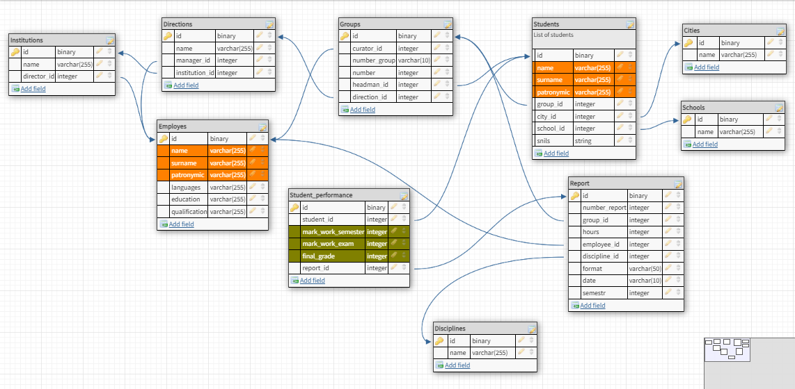

# База данных учет успеваемости студентов

## Разработка и согласование логической схемы БД для реализации проекта 

___

## Создание скриптов для построения БД проекта с реализацией обеспечения целостности данных на примере Oracle DB

[script create data base](create_bd/create_my_oracle_db.sql "Жми!")

___

## Создание встроенной функции генерации первичного ключа и использованием системной таблицы, описывающей объекты базы данных

Создание последовательностей из которых мы будем вытаскивать целые значения

[crate sequances](generate_primary_key/sequence_create.sql "Жми!")

Создание системной таблицы, из которой вытаскиваем коды таблиц и генерируем составной ключ

[crate system table](generate_primary_key/sys_table_create.sql "Жми!")

Создание функций для инкремента

[crate function_for_increment](generate_primary_key/function_for_increment.sql "Жми!")

Создание треггеров добавление составного ключа

[crate triggers](generate_primary_key/create_triggers_for_increment.sql "Жми!")

___

## Создание триггера для проверки инн студента

[inn_trigger](triggers_for_inn_and_snils/inn_trigger.sql "Жми!")

___

## Создание триггера для проверки снилса студента

[snils_trigger](triggers_for_inn_and_snils/snils_trigger.sql "Жми!")

___

## Логирование действий 

Логирование всех действий и занесение в системную таблицу.

Создание системной таблицы

[create table](log_out/create_log_table.sql "Жми!")

Создание триггеров логирования

[create triggers](log_out/my_log_triggers.sql "Жми!")

___